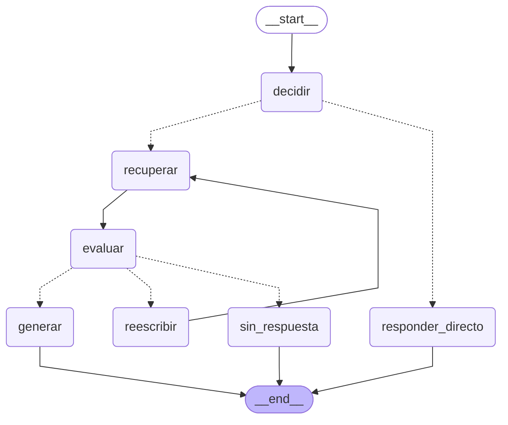

# Grafo de la capa agéntica y correctiva

Generado con `python scripts/dibujar_grafo.py` a partir de `grafo.py`. Las flechas discontinuas son aristas condicionales.

```mermaid
---
config:
  flowchart:
    curve: linear
---
graph TD;
	__start__([<p>__start__</p>]):::first
	decidir(decidir)
	responder_directo(responder_directo)
	recuperar(recuperar)
	evaluar(evaluar)
	reescribir(reescribir)
	generar(generar)
	sin_respuesta(sin_respuesta)
	__end__([<p>__end__</p>]):::last
	__start__ --> decidir;
	decidir -.-> recuperar;
	decidir -.-> responder_directo;
	evaluar -.-> generar;
	evaluar -.-> reescribir;
	evaluar -.-> sin_respuesta;
	recuperar --> evaluar;
	reescribir --> recuperar;
	generar --> __end__;
	responder_directo --> __end__;
	sin_respuesta --> __end__;
	classDef default fill:#f2f0ff,line-height:1.2
	classDef first fill-opacity:0
	classDef last fill:#bfb6fc
```
